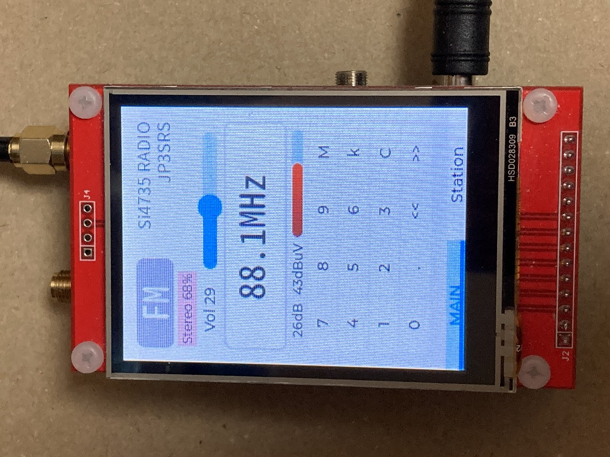
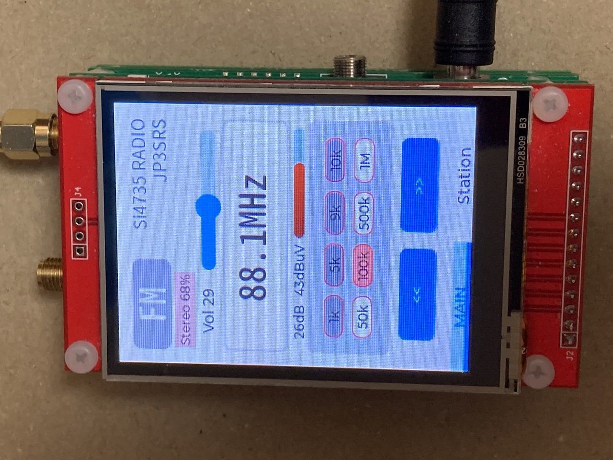
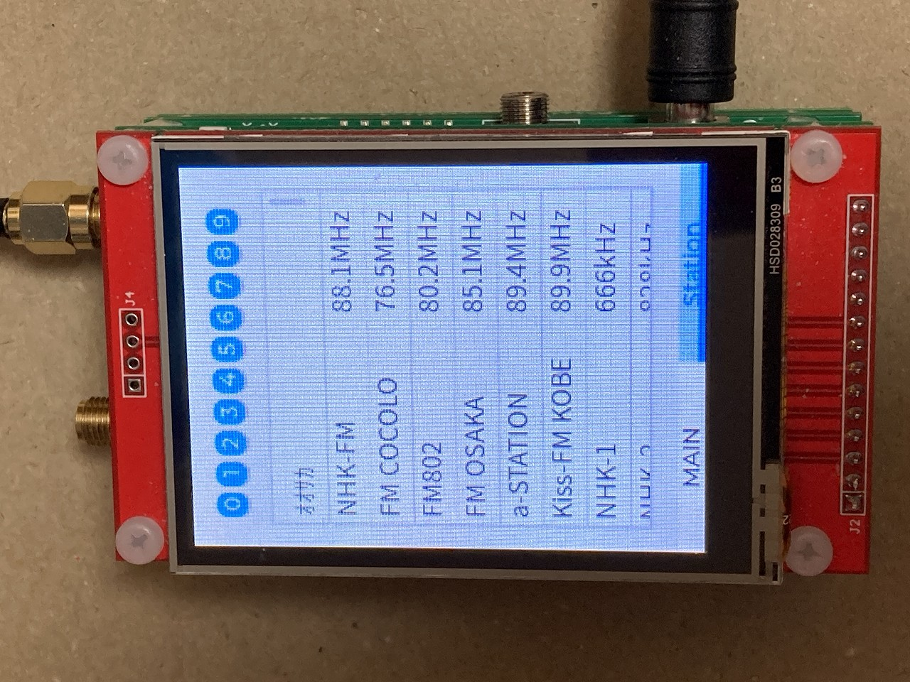

# Si4735ラジオ概要






Raspberry Pi Pico と ILI9341 タッチ液晶を使用し、Si4735 DSP ラジオチップを動かすラジオを製作しました。写真のように周波数を入力してチューニングする画面、ステップ周波数のUP/DOWNチューニング、選局リストからチューニングのモードを備えています。
このラジオの Raspberry Pi Pico のファームウエアは micropython に lvgl グラフィックライブラリをバインドした lv_micropython というものを使用しています。この lv_micropython は https://github.com/lvgl/lv_micropython にて公開されています。これにフリーフォントなどを加えたカスタマイズ版のファームウエアを作成しています。
このファームウエアに micropython で記述したラジオアプリケーションを動かして上記機能を実現しました。

## TODO

* 現在2023年4月12日に PCB 製造依頼した基板到着待ちです。この基板で1台試作して問題なく動けば、このラジオのガーバー情報。更新後の最新回路図並びに部品表を公開する予定です。

* 頒布につきましては、現状未定でございます。キットにしても完成品にしてもメーカー製ラジオを買うほうが大変お安く入手できる状況のためです。基板＋ネジ類だけの頒布など数パターン検討中です。

## 制限事項

* 画面ハングアップ

Raspberry Pi Pico の RAMが 264kB なので画面にグラフィックスウイジェットをたくさん出すとハングアップします。特に選局リストは放送局分のオブジェクトを内部で作成するので、選局リストをいじくりまわしていると固まることが多いです。選局して放置している分には特にハングアップは発生しません。
画面が動かなくなった場合が液晶基板右上に白いタクトスイッチが付いてます。これは RESET スイッチです。これを押して再起動してください。

今後 lvgl や micropython の新バージョンがリリースされても改善の見込みはありません。

* 電源スイッチはありません
* 電源電圧は 5V です。 

Raspberry Pi Pico のUSB端子もしくはとDCジャックから給電します。同時挿しも問題ありません。DCジャックから給電する場合は 5V のスイッチング AC アダプタを使用してください。トランス式 AC アダプタの場合は表示が 5V でも電源電圧が 5V 以上になっているため使用できません。ラジオのボードは壊れます。

* 放送受信状態は、ご使用になられる場所。アンテナなどの受信設備の違いなど。受信環境の変化要素が多いため一定の保証をすることは困難です。あらかじめご了承願います。

## 簡単な使用方法

### 周波数入力とステップチューニング切り替え

周波数入力選局とステップチューニング画面は、画面上の余白をロングタップすると切り替わります。

### 選局リスト表示

選局リストチューニングは画面をスワイプもしくは画面下部の Station を押すと画面遷移します。戻るときは画面下部の MAIN を押すか画面スワイプで戻ります。

選局リスト画面上部に 0 ～ 9 のボタンがあります。ボタンをクリックすると micropython 内部ファイルシステムに格納してある [0-9].txt のファイルをリードして画面に表示します。

選局したい局の行をクリックするとその放送局にチューニングします。

### 周波数入力チューニング

周波数入力する時は「Ｃ」ボタンを押して、周波数表示が消えた状態で数字を入れて「ｋ」か「Ｍ」ボタンをクリックして選局します。
入力途中で「Ｃ」を押すと元の周波数表示に戻ります。
「＜＜」「＞＞」はシークチューニングです。シーク後放送局が見つかるとシーク動作は停止します。

### ステップチューニング

周波数表示の下に選択可能な周波数ステップボタンが表示されています。画面下部の「<<」「>>」1回クリックすると指定されたステップでチューニングします。長押しで連続ステップチューニング動作をします。

## AMモードゲインボリューム

LW/MW/SW 受信時は SMA コネクタの後に 3SK291 を使用した1石高周波増幅回路を搭載しています。増幅率は左側面アンテナコネクタ近くにボリウムを設けています。このボリウムを回して放送の聞こえ具合を調整してください。左に回し切ると1石増幅器は停止し、放送は聞こえなくなります。右に回し切るとお住まいの電波環境にもよりますが複数の局が混信して聞こえることがあります。

## アンテナ端子について

正面から見て左が LW/MW/SW 用で右が FM 放送用のアンテナ端子です。アンテナ端子の形状は SMA タイプです。

## I2S 出力端子について

|端子名|備考|
|-|-|
|BCLK|ビットクロック|
|DATA|データ|
|LRCK|LRクロック|
|GND|グランド|
|NC|未接続|
|VCC|5V出力 3.3vではありません|

I2S 出力するときは、プログラムのラジオチップ初期化のコマンドを I2S 出力対応にする必要があります。

```
# Generate 48k I2S clock
# uncomment I2S OUTPUT
# @rp2.asm_pio(
#     sideset_init=(rp2.PIO.OUT_HIGH, rp2.PIO.OUT_HIGH)
# )
# def gen48k():
#     set(x, 30)       .side(0b00) [1]
#     nop()            .side(0b01) [1]
#     label("L01")
#     nop()            .side(0b00) [1]
#     jmp(x_dec, "L01").side(0b01) [1]
#     set(x, 30)       .side(0b10) [1]
#     nop()            .side(0b11) [1]
#     label("R01")
#     nop()            .side(0b10) [1]
#     jmp(x_dec, "R01").side(0b11) [1]
# 
# sm0 = rp2.StateMachine(
#     0,
#     gen48k,
#     freq=12_288_000,
#     sideset_base=machine.Pin(4)
# )
# sm0.active(1)
```

のコメントを外します。
また、

```
    def FMPOWER_UP(self):
        self.i2c.writeto(self.addr, bytes([0x01, 0x00, 0x05]))  # analog Out
#         self.i2c.writeto(self.addr, bytes([0x01, 0x00, 0xB0]))   # I2S
        self.waitCTS()
        time.sleep(0.5)
        self.setProperty(bytes([0xFF, 0x00, 0x00, 0x00]))          # Turn off Debug Mode
#         self.setProperty(bytes([0x01, 0x04, 0xBB, 0x80]))        # I2s sample rate
```
```
    def AMPOWER_UP(self):
        self.i2c.writeto(self.addr, bytes([0x01, 0x01, 0x05])) # analog out
#         self.i2c.writeto(self.addr, bytes([0x01, 0x01, 0xB0]))  # I2S
        self.waitCTS()
        time.sleep(0.5)
        self.setProperty(bytes([0xFF, 0x00, 0x00, 0x00]))         # Turn off Debug Mode
#         self.setProperty(bytes([0x01, 0x04, 0xBB, 0x80]))       # I2S sample rate
```
の # analog out の行をコメントアウトして i2s のコメントを外すと I2S 出力になります。

デフォルトは 16bit/48k になります。

# プログラム更新

## thonny IDE
今回、ラジオのアプリケーション作成には 
Thonny Python IDE for beginners

https://thonny.org/

で、公開されている IDE を使用しています。
プログラムの修正などしてみる場合はこれをインストールして Si4735Radio の USB 接続すれば lv_micropython の REPL が使えるようになります。

ローカルのファイルを lv_micropython のファイルシステムにコピーしたりその逆も可。ファイルの修正も可能です。

## ファームウエア更新

液晶基板上側両再度に白いタクトスイッチが左右2個付いています。右がリセット・左がBOOTです。

「左BOOT」「右RESET」 両方押す

「右RESET」 離す

「左BOOT」 離す

この後 Raspberry Pi Pico は USB メモリモードになってホスト側PCのファイルに RPI PICO のドライブが使えるようになります。ここに .uf2 ファイルのドラッグ・ドロップ(コピーペースト)すればファームウエアの更新が可能です。
